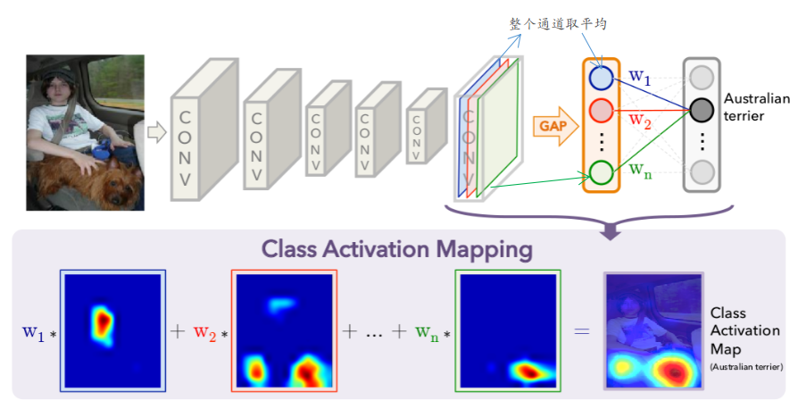
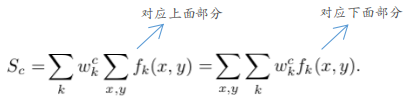
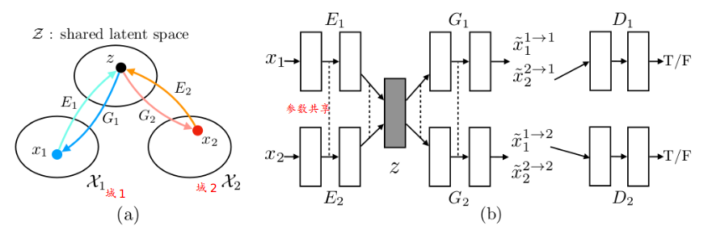

## Learning Deep Features for Discriminative Localization

主要内容：

1. 引入了class activation mapping的概念，有助于理解CNN学到的特征对分类的影响。
2. 通过class activation mapping来探究不同区域的“特征”信息对最终分类的影响。
3. 能够有效的应用于弱监督定位，可视化等问题

### 原理

说明：① 将常见的分类网络的“最终”特征层后续的全连接层改为上述的GAP和Softmax操作

对应表达式：

从式子后半部分可知：反映的恰好是不同通道对应的特征层对最后分类的类别的比重。即(class activation mapping，在其他论文中也可以称之为热区)

## Unsupervised Image-to-Image Translation Networks

主要内容：

1. 无监督的图像域转变（一个域到另一域）：主要是无成对训练图时的策略
2. 建立边缘分布与联合分布之间的“桥梁”（通过一些技巧限制联合分布的情况）

### 原理

说明：① 将两个域均投射到一个假设的“公共域Z”中（此处是将VAE中的code作为此公共域），且满足成对的对象$(x_1,x_2)$在均投影到公共域内的同一个“位置”  ② 其中$x_1^{1\to1},x_2^{2\to1}$: 分别代表由域1到域1和域2到域1的生成  ③ 总共采用了6个网络，如上图所示。且满足 1.“auto-encoder”能力$x_1=G_1(E_1(x_1))， x_2=G_2(E_2(x_2))$  2. "cycle-consistency"能力：$x_1=G_1(E_2(G_2(E_1(x_1))))$：即类似与cycle-gan里面的内容

一些技巧：

1. 利用了“高层特征”参数共享从而使得成对对象$(x_1,x_2)$能够投影到同一位置（一个简单例子：$x_1,x_2$分别为不同场景(场景对应域)中的车，但在高维特征上面，车的特征均是相同的。---也可以借鉴[Universal style transfer via feature transforms](https://arxiv.org/abs/1705.08086)中的概念，可以将前半部分E中的非共享参数视为“去场景化”，后面G中的非共享参数视为“加场景化”）
2. 关于判别器，为了简化，只处理$x_2^{2\to1},x_1^{1\to2}$生成的图片

