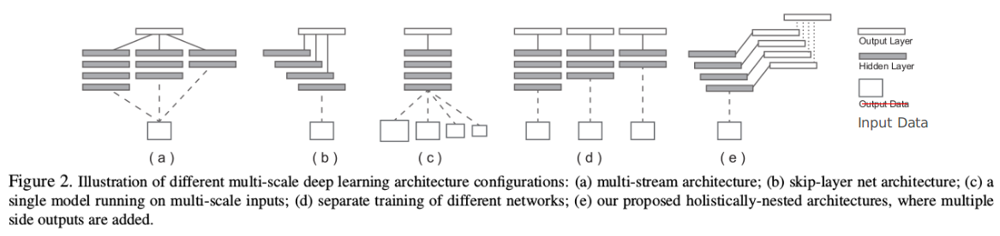
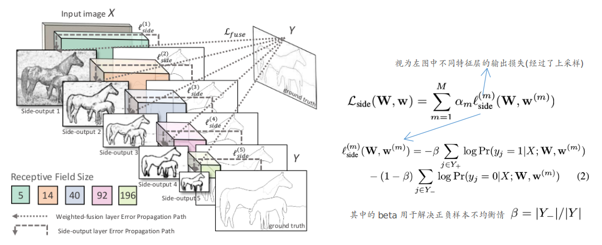
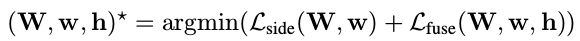
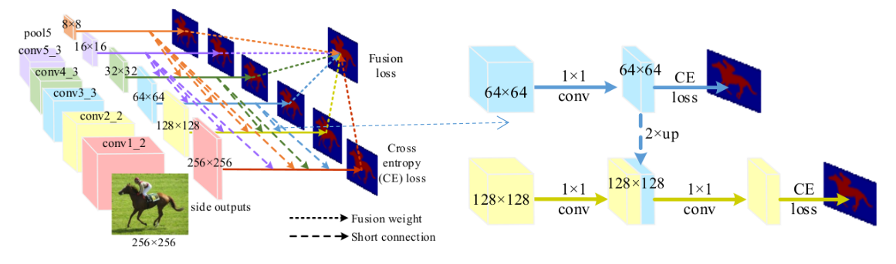
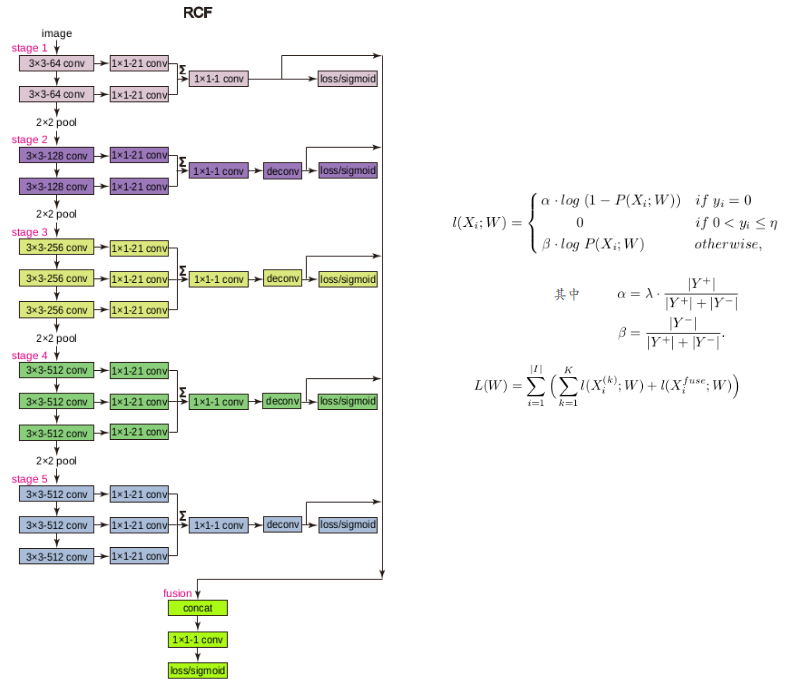

## Holistically-Nested Edge Detection

主要内容：

1. 发现在“高层次特征”上面能够更好的把握大局（在边缘分割上面可以理解为整体的边缘轮廓），而在“低层次特征”上面则对细节也可称空间信息能够更好的刻画。因此，此论文主要是结合高层次+低层次特征各自的特点，融合起来更好的进行边缘轮廓提取（这种类似的方式其实在很多其他视觉领域的问题上也很多）
2. 不仅仅只是后续的融合层，前面的各层也同时纳入损失函数（这样的好处：前面的各层分的越好，也会使得融合层效果更好）

额外内容：（此论文中总结了不同感受野下的特征结合的方式。下图中output data指的是上一层的输出数据，此处个人改为input data只是为了便于理解）

(a). 主要通过不同的卷积大小来实现不同的感受野（在GoogleNet等结构中有使用）

(b). 将不同层的特征(对应不同大小的感受野)直接结合起来

(c). 利用不同大小的输入来实现

(d). 利用数目不同的卷积

(e). 此论文中采用的结构

### 原理

最终的损失还包括fuse层的cross-entropy损失：

注：在测试阶段，此论文中采用的是上述5个side层的结果和fuse层的结果的平均

## Deeply Supervised Salient Object Detection with Short Connections

主要内容：

1. 可以认为是上面这篇论文从边缘分割领域“转移到”显著目标检测问题上面。论文中作者发现直接移植同样的模型效果并不好。因此进一步增加了“高层次特征”和“低层次特征”之间的交互。（低层次特征的检测上面加入高层次的特征：个人的一种直观理解，对于检测而言，不仅仅只是边缘，也需要内部信息，而高维特征更大的感受野在这方面具有大的优势。）

### 原理

在损失函数方面，和上面论文中的主要区别在于不存在正负样本不均衡的问题了。其他基本一样

此外在测试阶段，这篇论文指出如果想“更好”，可以对最后结果再进行一次条件随机场操作（具体如何操作见论文）

## Richer Convolutional Features for Edge Detection

主要内容：

1. 和第二篇论文是同一个实验室出的论文，其实内容和上面两篇基本没什么大的不同。也是处理边缘轮廓检测的问题。这篇在实现上面将高层次和低层次特征“分的更细”了

### 原理

其中的损失函数在label上面稍微做了一些不一样的处理。其他的各方面这几篇文章从根本上而言基本是一样的。