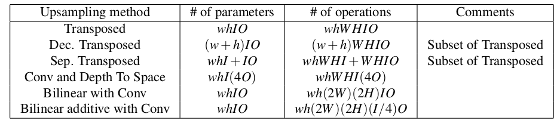

## The Devil is in the Decoder (*)

主要内容（这篇文章非常推荐阅读）：

1. 主要探究什么样的结构更适合“解码器”（主要的落脚点在上采样上面）
2. 介绍并对比了各种“up-sampling”层（① Transposed Convolution  ② Decomposed Transposed Convolution  ③ Separable Transposed Convolution  ④ Depth To Space  ⑤ Bilinear upsampling  ⑥ Bilinear additive upsampling）
3. 通过实验对比上述几种方法，以及分析skip connections和residual connections带来的影响

### 1. 上采样方法简介

① Transposed Convolution

说明：(其实转置卷积本质上就是卷积---先填充0再卷积)

- 上述是对应kernel size=3, stride=2的情况（别误以为stride=1）。其中输入输出的尺寸的对应关系为：
  $$
  H_{out}=(H_{in}−1)∗stride−2∗padding+kernel\_size+output\_padding
  $$

② Decomposed Transposed Convolution

说明：

- 其实就可以看成正向卷积采用`1x3+3x1`替代`3x3`，反过来也是一样的原理
- 其实就是Transposed Convolution的子集：可以从等价关系发现，其参数减少了：`6IO vs 9IO `

③ Separable Transposed Convolution

说明：

- 也是Transposed Convolution的子集：只是参数更加少了（主要在于各个channel单独采用`3x3`的卷积，而后续从`in_channel->out_channel`只采用`1x1`的卷积）

④ Depth To Space

说明：

- 可以理解为4通道结合为1通道：从而使得W,H增大一倍
- 这种方式存在的一个问题就是alignment artifacts （个人理解为如何去安排`x1, y1, z1, t1`的位置呢）

⑤ Bilinear upsampling

就是双线性插值法来Resize“图片”的大小，这个就不给出图例了（可看⑥中的左边图），属于众所周知的方法。再在其后面接上上述`kernel=3, stride=1`的卷积操作

⑥ Bilinear additive upsampling

说明：

- 这种是作者新提出的方法，可以理解为④和⑤的融合，同时客服了④中存在的问题。

#### 上述6种方法参数量和计算量的比较

说明： 

1. 其中w,h代表kernel的大小，W,H代表“图片”(特征层)的大小，I代表in_channel, O代表out_channel
2. ⑤⑥两种在上述图的后续加上`kernel=3x3, stride=1 `的卷积

### 2. skip connection & residual connection

① skip connection

采用此方式对大部分任务均有性能提升，但是显然能使用的前提是具备前面的encoder（解码器）部分才行（更准确的说明是存在对应同分辨率的情况）。

② residual connection

由residual的定义可知，相加两部分需要是相同的尺寸，因此需要对前面部分先进行upsamling（此处专指residual出来的哪部分，即upsampling2），因此就有前面6种可供选择方案。从作者的实验结果来看，采用下述两种情况结果是最好的：1). transposed convolutions+residual connections, 2). bilinear additive upsampling + residual connections

### 3. 其他

更多比较实验等，请见文章。

## Instance-Level Salient Object Segmentation

主要内容：

1. 不仅仅解决显著目标检测，还能够将“各个显著目标”给分割开来

说明：由于20180103中的文章是关于显著目标识别的，而这些方法从形式上而言都是大同小异，主要是网络结构稍微改动下(但其实17年这几篇的改动方向都是一致的：high level+low level)，因此此处比较粗略的给出其主要内容。

### 主要原理

说明：

1. 上述中的attention module对应上面右下角的图。其实这里的attention就是几个卷积根据vgg的输出来产生weights map，即让网络自己来确定vgg输出“每点的重要性”
2. 得到saliency map和contour map是采用不同的网络参数（不知道我也没有理解错）。
3. 后续得到proposals这一步是采用multiscale combinatorial grouping (MCG)算法来实现的
4. 之后的后处理采用CRF等方法，这些内容请自行看文章。

