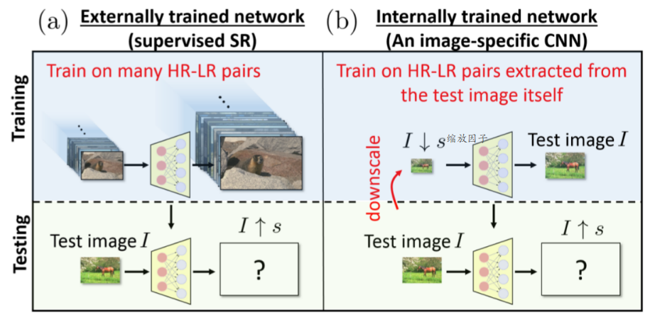
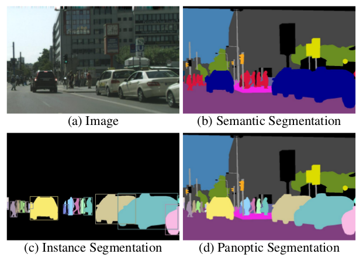
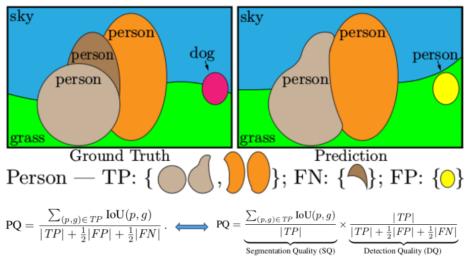

## "Zero-Shot" Super-Resolution using Deep Internal Learning(*)

主要内容：

1. 另辟蹊径地利用CNN来处理“单张”图片（训练-测试均只针对此图，有点儿类似数学中的通过迭代的方式解目标函数）
2. 不是只针对“单一类型”的超分辨问题，能够根据图像本身的“性质”来解决不同的超分辨情况（常规的超分辨网络只能处理特定类型的情况，如2x的情况等等）
3. 属于无监督学习的范畴（与之前的一篇[Unsupervised Image-to-Image Translation Networks](../20180102/20180102.md)属于不同类型的情况）

### 主要原理

核心思想：①. 图像内部各个patch之间的关联性要比各种图像之间的关联性更强，比如图像内部很多部分其实是重复出现的(可能大小不同，尤其是背景中的一些情况)  ②. 针对超分辨这种情况，从图像本身更能反映其到底属于“哪一类”超分辨情况，能够“对症下药” 

主要框架（常规的超分辨CNN和此处采用的方法）：

说明：

1. 实现时，并不是在网络中采用上采样(例如transpose deconvolution)等操作，网络本身并不改变图片的size，而是先将downscaled的图片先通过插值的方法先复原到和Test image I一样大，再作为输入。
2. 这种策略有点类型：我既然不知道“变大”的情况，那我先从自身缩小的情况出来来寻找自己内在的低分辨规律。
3. 真实训练时并不只有这一对pair：(downscale image, Test image I)，还经过了一系列图像增强的方法：
   - 采用各种不同的缩放因子
   - 采用Random-Crop操作
   - 采用图像旋转(0, 90, 180, 270°)以及图像左右上下翻转
   - ......

## Panoptic Segmentation

主要内容：

1. 提出了一种新的“分割任务”：全景分割---结合了Semantic Segmentation和Instance Segmentation (具体定义可以从下面的图中得知)
2. 提出了这种“分割任务”的一种衡量指标“panoptic quality (PQ) measure”
3. 对目前semantic segmentation和instance segmentation进行了分析和说明
4. 给出了一些实验情况

说明：这篇后续的内容没有看，此处只给出笼统的说明。

### 主要原理

几种不同分割任务的区别：

说明：(b)语义分割：可以视为像素点的分类问题  (c)实例分割：分割出的实例往往基于先找出的boundary boxes (d)全景分割：更类似语义分割，再此基础上还需要区分出每一个实例

意义：通常情况下，语义分割往往视为分类问题（每个像素点属于哪一类）；实例分割则往往可以视为基于目标识别之后的分割。这样就导致这两者可以视为“两个流派”。而全新的任务“全景分割”则希望能够同时处理这两类问题。

### 衡量指标：PQ测度

分为两步：① 实例匹配 (instance matching)  ② PQ指标 (PQ computation given the matches)

① 实例匹配

满足一个定理：对于给定的预测map和ground truth，每个“ground truth实例”只有一个对应的预测实例与之的IOU大于0.5（具体说明见论文）

② PQ指标

说明：由于实例匹配阶段的定理，就不存在TF的情况了。