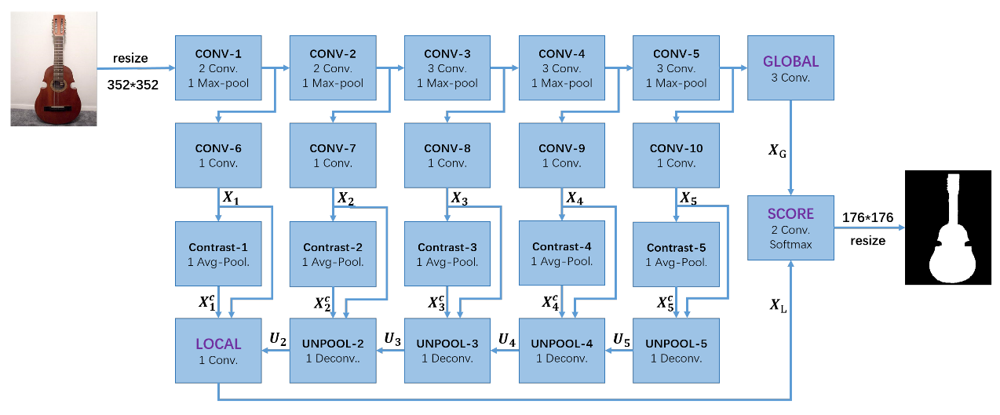
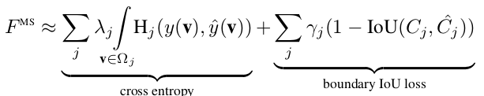
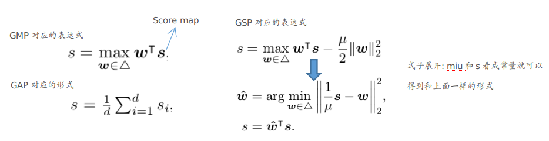
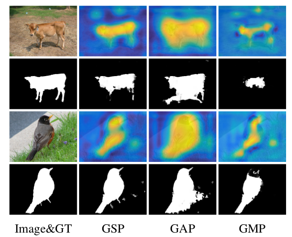
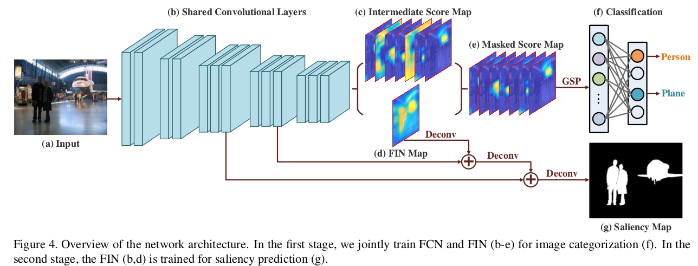

## Non-Local Deep Features for Salient Object Detection

主要内容：

1. 将boundary iou加入到损失函数中（这样得到的结果边缘更好，无需CRF等后续操作）
2. 采用grid-CNN来处理此问题（其实个人认为这种结构可以视为[Deeply Supervised Salient Object Detection with Short Connections](../20180103.md)的另一种方式，将不同level的信息直接融合起来，而不是融合再加上各自的loss情况）

注：个人复现了这篇文章的结果，觉得采用area iou其实效果更好。

### 主要原理

① 网络结果

说明：这部分具体的细节可看个人的实现，其实也是17年这类问题常用的方法，结合high level的特征信息和low level的特征信息

② 损失函数

加入了这个boundary IOU，效果确实提升挺明显的。此外，对收敛效率也有一定的帮助

## Learning to Detect Salient Objects with Image-level Supervision (*)

主要内容：

1. 针对“显著目标检测”的弱监督问题（只提供类别信息）
2. 提出了一种更适合此类问题的pool层：global smooth pooling
3. 将整个架构分成两个阶段：① 通过类别信息来获得saliency maps  ② 采用一些处理方式(iterative Conditional Random Field)对saliency maps进行处理来获得更好的结果，再以此为ground truth对网络进行微调

### 主要原理

#### 第一阶段

① global smooth pooling

说明：GMP过分看重最大的那部分(难以包含整个物体)，而GAP则太过平均(容易导致包含的区域过大)。而GSP可以看成两者的折中(前面一项是GMP的形式，而正则项又将其往GAP的形式靠)。

作者也给出了图像来说明这个问题：

② Foreground Inference Network

说明：① 此处说的Foreground Inference Network指的是图中的FIN部分。② 将FIN Map与Intermediate score map进行点乘的原因主要在于使得FIN Map不仅仅针对现有的这些类别（因为中间过程的score map包含的特征信息是更通用的）

采用这种形式的FIN Map作为此阶段的Saliency map而不是直接将Score Map作为Saliency map的原因：

1. 在显著目标检测问题中，我们更关注的是包含物体的区域而不是关注有哪些类别。且直接采用score map的平均形式存在下述问题：
   - 不同channel上面的尺度不一样
   - score map的热区不太容易均匀的在目标物体上“铺展开来”

具体的训练细节，如损失函数上面对f进行约束等详见文章。

#### 第二阶段（这部分原理没太懂: 待完善）

自我修正阶段：在下述两者之间迭代进行修正---① 通过FIN预测saliency map ② 通过预测的saliency map(此处进行了一些处理)来微调FIN

加强预测得到的ground truth的两者方法：refinement with the proposed CRF 和 fine-tuning with the robust loss

