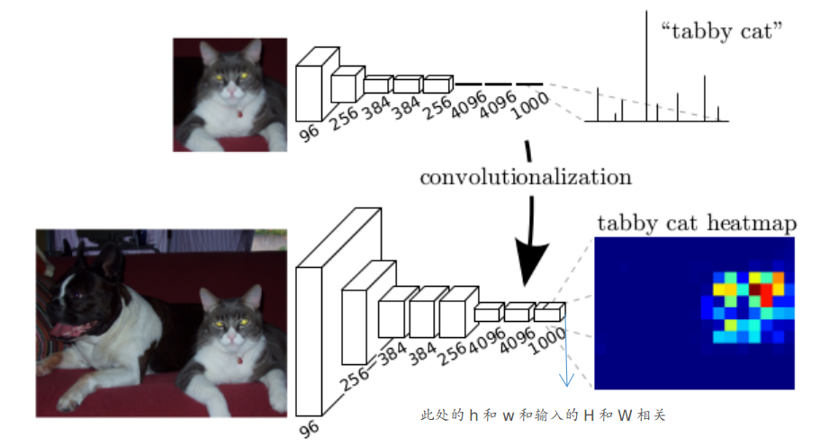
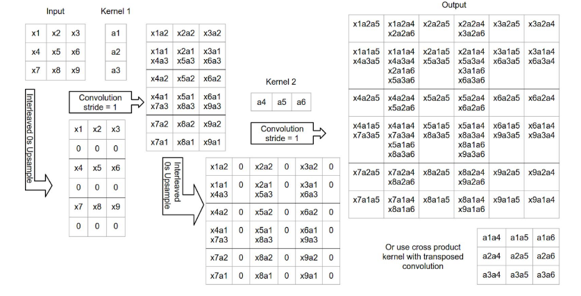
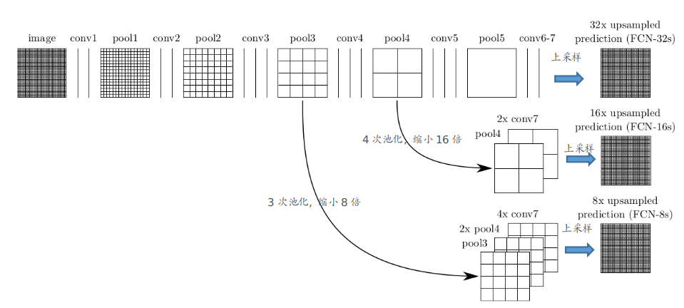
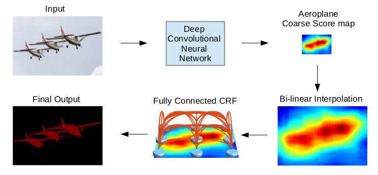
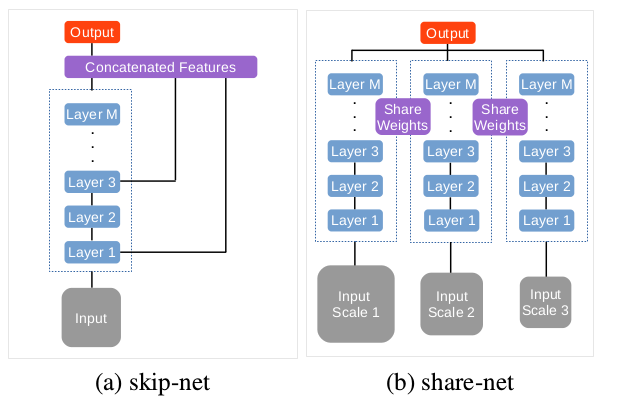
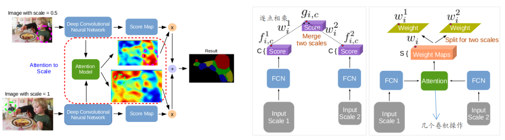

## Fully Convolutional Networks for Semantic Segmentation

主要内容：

1. 将CNN引入到图像分割领域（之前更注重“高抽象”的特征，但是到了分割，就不能仅仅只关注“高抽象特征”：容易丢失边缘等信息）
2. 利用卷积操作取代全连接操作：现在大部分(图-图，图-概率map)的问题都采用这种FCN结构
3. 采用Deconv和skip connection操作（更多这方面总结可见[The Devils is in the Decoder](../20180104/20180104.md)）

### 主要原理

① 全连接层变为卷积层

② 上采样操作

（更多上采样的知识见前面给出的链接）

这步主要为了将①中的`hxw`上采样到和输入同大小`HxW`（由于ground truth的大小就是`HxW`）

③ 采用skip结构

主要为了解决“高层次特征”对于空间信息保存较差，因此采用skip结构。（后续很多关于分割的文章均是从这个角度去改进的）

## Semantic Image Segmentation with Deep Convolutional Nets and Fully Connected CRFS

主要内容：

1. 将CRF (条件随机场)作为后处理来进一步改善分割结果
2. 引入了“dilated”卷积结构（此处采用的不是这个术语，但个人觉得应该是一致的）
3. 采用了multi-scale的方式

### 主要原理

① CRF作为后处理

关于Fully Connected CRF，可以参考论文：[Efficient Inference in Fully Connected CRFs with Gaussian Edge Potentials](https://arxiv.org/abs/1210.5644)，或者[FCN](https://zhuanlan.zhihu.com/p/22464594)（这块数学原理确实难>.<）

② dilated卷积结构

这种结构能够保留更大的感受野（从而使得文章在pool层的时候采用stride=1，并不改变size）

③ 采用multi-scale结构

类似FCN中的skip方法：在连出来部分再接几个卷积操作

这几篇文章更加详细的总结可见：[图像语义分割](https://zhuanlan.zhihu.com/p/22308032)

## Attention to Scale: Scale-aware Semantic Image Segmentation

注：这篇和上一篇是同一个作者写的，可以看成上一篇的延伸

主要内容：

1. 总结了multi-scale的两种常用方法
2. 引入attention机制

### 主要原理

① 两种常见的multi-scale方法：

skip方式：将不同特征层提取的特征结合起来（个人看到这种方式更多）

share方式：采用不同大小的输入（此文章采用这种方式）

采用这些方式主要是为了更好地保留空间位置信息（针对分割任务则更侧重于边缘轮廓信息）

② attention机制

其实attention机制可以简单的理解为：通过特征取学习一个权值map来结合不同scale输入所获得的score map。（这样就能够包含的情况更多：这种方式包含avg-pool和max-pool的形式:指对单点所有通道进行）

③ 其他

这个实现在损失函数上面稍微有些不同：不仅仅只有最后的不同score map相结合与ground truth进行比较，还包含每个单独的score map与ground truth进行比较，因此总共有S+1个cross-entropy（S代表有S种不同的输入尺寸）