## Semantic Image Segmentation via Deep Parsing Network (*)

主要内容：

1. MRF(马尔科夫随机场)简介
2. “扩展”MRF的能量函数
3. 转化为网络结构

### 主要内容

#### ① MRF简介

马尔科夫随机场对应的能量函数往往由两项构成：Unary (一元项：刻画该点信息) 和 Pair(二元项：刻画该点和其他点之间的信息关系)

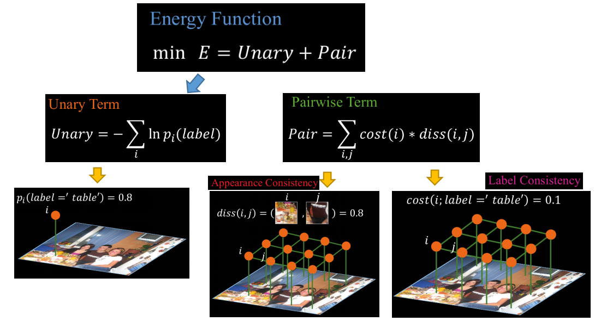

1. 一元项：刻画将标签label分给图像上点i的代价
2. 二元项：diss(i, j)可以理解为i, j两个位置为同标签label的代价 (你可以这样想：只有两者均是相同label的概率最高时，其代价会最小---因为其他标签就会非常小)    cost(i, j)可以理解为标签一致性？（这里个人还是有些困惑）
   常规的二元项：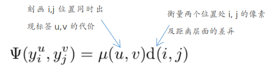

#### ② pairwise term (二元项)的扩展

1. 扩展diss(i, j)项：不仅仅衡量i, j两个位置同label的可能性，还包括j周边的多个邻居的情况
   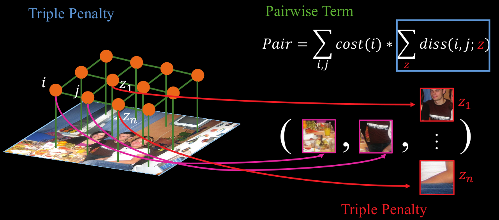
2. 扩展cost(i, j)项：混合标签内容---考虑类别空间信息 （这部分个人不太理解）
   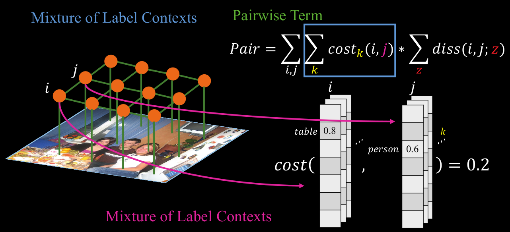

“推理---预测”阶段利用Mean-Field算法，利用Q替代E等方式能够知道最后的闭式解为：（这部分数学原理较复杂，需要看其他文章）

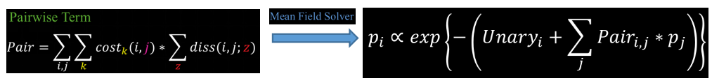

说明：其中的$p_j$初始化为网络输出的概率map

后续就是将右边的解得形式用网络来表示（这部分个人总觉得这篇文章中的方式和这条表达式不那么对应）

#### ③ 网络化

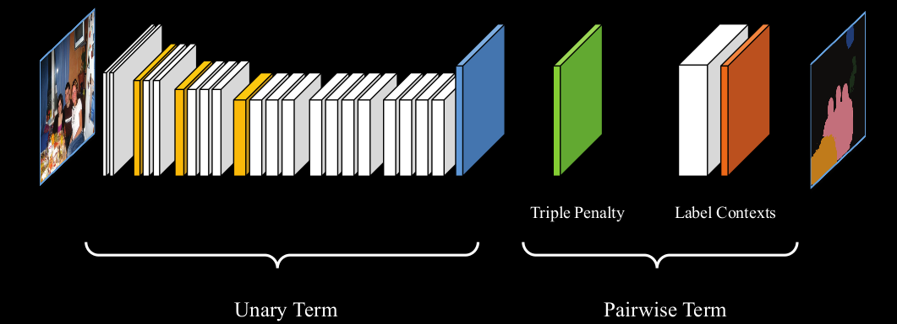

其中：

1. 上述的Unary Term的输出此处为概率map（而不是$\Phi=-ln(p)$的形式）--- 理解为初始化的$p$或许更合理
2. Triple Penalty部分(diss部分)的结构：(此处采用size=50的情况，个人认为是由于上述j其实理论上是图像上的每个位置，而此处只是取了50x50个区域。但和表达式又有些不同)
   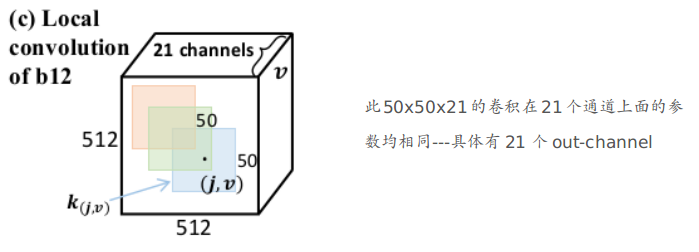
3. Label Contexts部分(cost部分)的结构：卷积+局部通道池化操作
   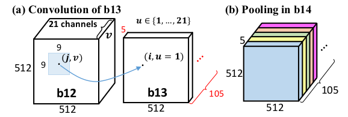

最终的输出根据下述表达式计算（此处指的是inference阶段，训练的时候文章中是按每个阶段分别将map与最终的label进行cross-entropy进行fine-tuning的）--- 此式子对应②部分最后的那条表达式

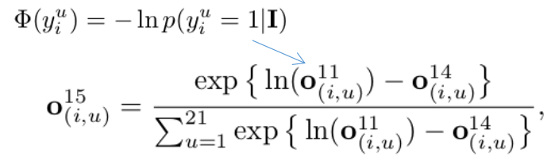

## Fast, Exact and Multi-Scale Inference for Semantic Image Segmentation with Deep Gaussian CRFs

主要内容：

1. 采用Gaussian CRFs（高斯条件随机场）：其实文章中就是将能量函数替换成了更简洁的形式。而这种形式其实就是二次型优化问题，非常便于求解
2. 将具体的各部分参数转换成网络的形式来学习

### 主要内容

#### ① “新”的能量函数

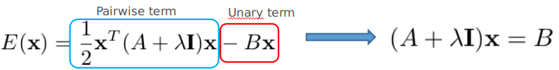

说明：

1. 其中A: NxN (N=PxL --- P为全部像素点个数, L为类别数目)     X: Nx1    B: 1xN
2. 关于这条式子具体如何求导求解等请看文章
3. 由于A太庞大了，参数过多，引入了下面的形式（Potts-types）：
   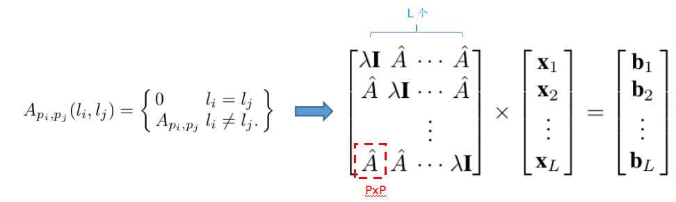

#### ② 网络化

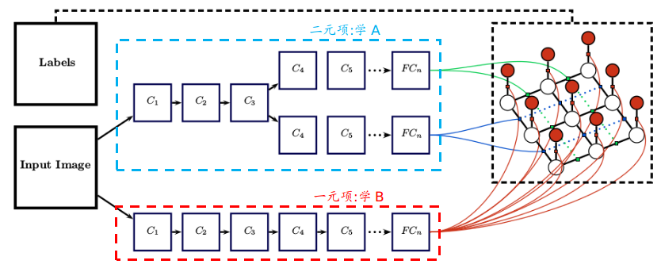

## Deep, Dense, and Low-Rank Gaussian Conditional Random Fields

说明：可以视为上一篇的扩展

主要内容：

1. 简化后的上篇文章的A还不够强，并不能刻画fully connected CRFs的情况。此处采用低秩的形式来刻画A，从能既能保证A的复杂性，又不会导致参数过多
2. 转化为网络的形式：采用目前最好的DeepLab的结构

### 主要内容

① “低秩化”A 

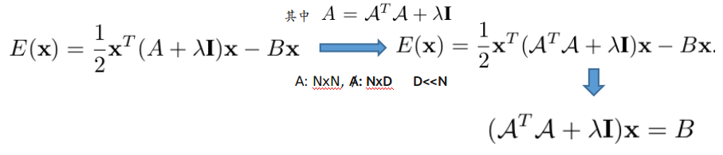

说明：

1. 关于具体如何求解等等请看论文

② 网络结构

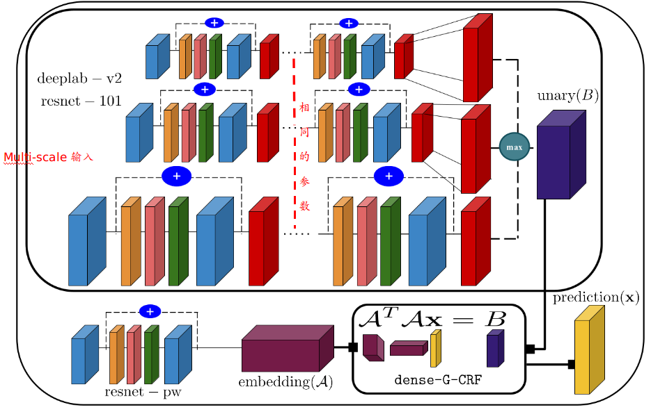

