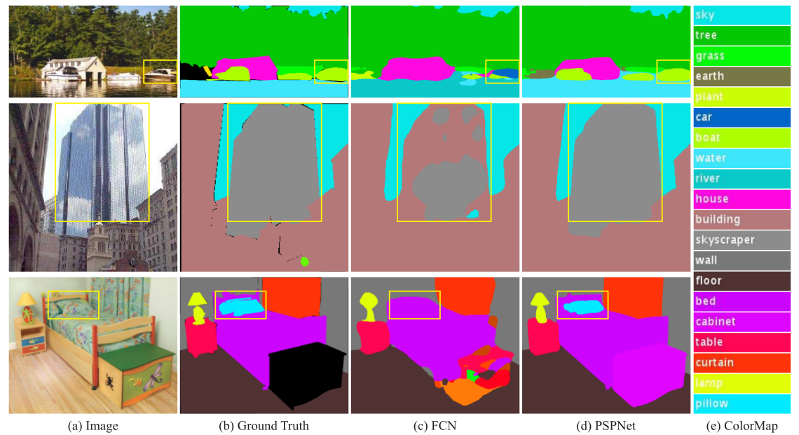
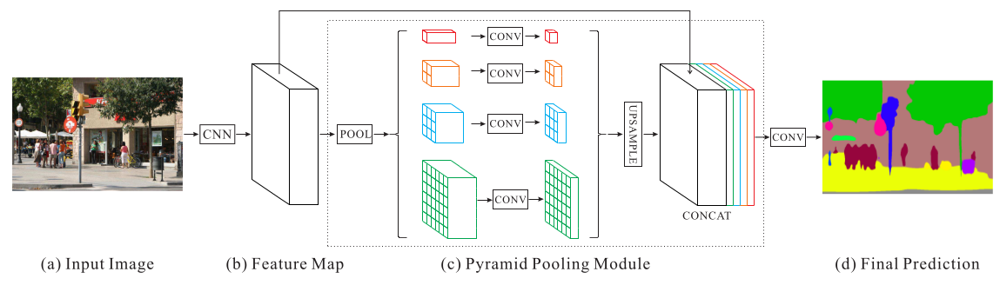
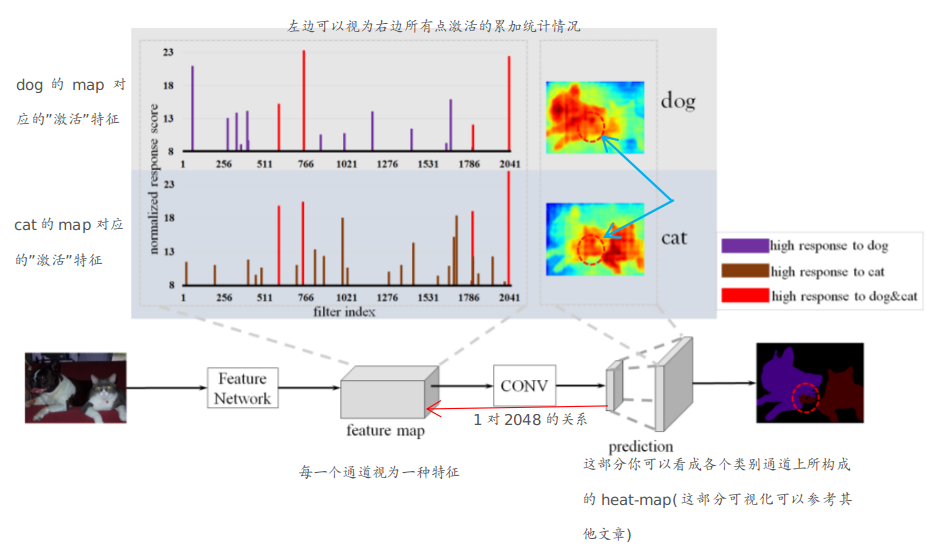
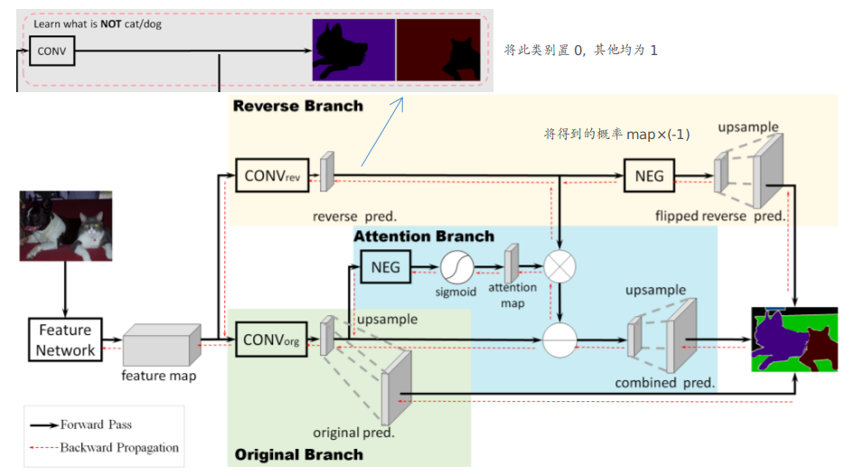

## Pyramid Scene Parsing Network

主要内容：

1. 介绍场景分割中的一些难点
2. Pyramid Pooling结构
3. 训练的一些细节

### 主要内容

#### ① 场景分割中的难点

1. 类别间错误的匹配关系：物体往往与场景之间有密切的联系(这就说明要结合场景来区分其中的物体---暗含需要尽可能的全局信息)。如上图第一行中框出来的是船（因为在湖上面）而不是车。
2. 类别之间太相似：在一些场景中，有些物体是非常相近的（如mountain和hill等），此时就非常容易将其误分。如上图中第二行中既有skyscraper，又有building。解决方法往往是通过运用类别之间的相关性（可以理解为和周边物体的一致性？）
3. 不显眼的类别：某些类别非常不显著（如第三行中的枕头），此时往往需要更加小的感受野来发现这些不显眼的物体

上述这些情况，整体而言可以视为：场景分割中要兼顾全局和局部

#### ② Pyramid Pooling Module

从上述可见，主要加入的部分就是Pyramid Pooling Module。这部分采用不同大小的池化操作来获得不同“大小”的视野（从而来兼顾全局和局部），再将其与原来的特征”并“起来即可

#### ③ 训练时的技巧 

详见文章中的第4部分

## Semantic Segmentation with Reverse Attention (*)

主要内容：

1. FCN存在的问题
2. Reverse Attention Network架构

### 主要内容

#### ① FCN存在的问题

说明：

1. 误分类情况非常容易出现在一些”歧义区域“，这些区域在不同类别之间具有非常相似的空间特性（如上图中的蓝色箭头区域，其对于猫和狗而言都是非常显著的）--- 即这款区域导致了存在相同filter均高频出现
2. FCN并没有没针对这种confusing的类别进行处理

#### ② RAN架构

可以分成3部分：

1. Original Branch：即FCN部分，FCN完全一致。学一个多类别的概率map
2. Reverse Branch：可以理解为此部分先学"背景"（其ground truth可以看成单类别为0，其他为1的各类别组成的多通道0-1标签图）。再将其结果乘以-1（则此时显然得到的概率map的背景和物体的概率大小就反过来了---由于后续会有softmax操作，为负是不影响其概率分配的）
3. Attention Branch：并没有直接将”正向概率map“减去”负向概率map“（因为负向概率map可能也做的不好）。引入此attention branch，主要关注那些被正向概率map轻视的部分（正向概率高的×(-1)后就在attention map上对应小的值）

这部分待进一步补充