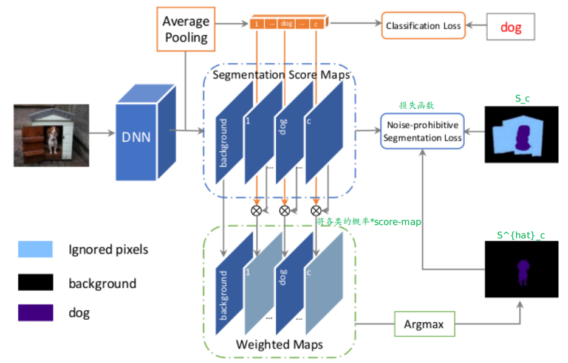

## Object Region Mining with Adversarial Erasing: A Simple Classification to Semantic Segmentation Approach

主要内容：

1. 弱监督语义分割任务：通过“擦除机制”(adversarial erasing)+“保护机制“(prohibitive segmentation learning approach)

说明：

1. 基于分类信息的弱监督学习
2. 下述内容主要分为：”擦除机制“+”拆分机制“(saliency map)+”保护机制“来展开

### 主要内容

#### ① 擦除机制（adversarial erasing）

上述过程可以这么理解：第一次分类时对应的heat-map主要为”狗头“，此时我们将”狗头“的信息从原图删除(利用mask)，第二次分类时对应的heat-map为”狗身体“，再将此”狗身体“信息从图中删除。不断迭代下去，直到没有信息好删除了。（这么做的原因：分类往往基于”显著“特征，因此单纯从分类产生的热区很难一次性产生较好的分割区域）

这样不断迭代后就可以得到”较粗糙“，但囊括的分割区域已经相当丰富了。

#### ② ”拆分机制“（Saliency map）

说明：RC可以采用一些显著目标检测的方法(salient object detection)来获得”分割map“(为前景-背景的概率map: 低于某个阈值的直接设置为背景)。从而区分出背景来（图中蓝色的地方姑且可以理解为”不确定“区域）（这么做的主要原因是拆分出背景和前景以及不确定区域）

#### ③ ”保护机制“（prohibitive segmentation learning approach）

1. 上述将”类别概率“×score maps：主要为了增强目标类别所占的比例（比如此处是分割狗，如果在猫的score-map上面存在一些区域的score非常高---比较常见毕竟猫狗有些部分相似，显然会对结果造成干扰）

上述机制对应的损失函数如下：

注：其中u代表每一个像素点位置

1. 相当于既要去”迎合“：$S_c$，也要取”迎合“：$\hat{S_c}$
2. 这部分也可以直接理解为后处理

## Amulet: Aggregating Multi-level Convolutional Features for Salient Object Detection

主要内容：（这篇文章个人感觉这些结构有些过了）

1. Amulet结构：
   - 特征提取部分（multi-level feature extraction）
   - 融合出不同分辨率的特征（resolution-based feature integration）
   - 递归式概率map预测（recursive saliency map prediction）
   - 边缘保护机制（boundary preserved refinement）

### 主要内容

整体网络结构：

Part 1：提取出不同“级别”的特征（“越高级”的特征包含的全局信息更多，“越低级”的特征对空间信息保存的更好），图中的五种不同颜色的箭头可以视为这5种不同级别的特征

Part 2：特征融合 --- 将这5种不同级别特征融合成不同分辨率的特征，这一步的具体结构如下图所示：（这一步主要为了融合不同级别的特征，不同的分辨率能更好地适应不同大小的ground truth情况）

Part 3：从后往前与ground truth进行“比较”（每次将后面得到的概率map融入到前面过程，能够充分利用信息）

Part 4：将Conv1-2的信息再次利用起来（因为这一特征的边缘保护最强），从而能够使得最后得到的结果的边缘更加好

在后再利用卷积操作将前面的5个预测结果给融合起来（这样最终其实有6个预测结果---损失其实就是6个softmax相加）

