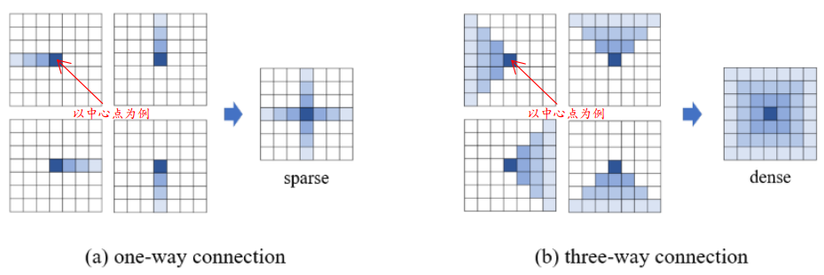

## Dilated Residual Networks

主要内容：

1. 利用Dilated卷积操作保持不降低分辨率的前提下还有同样的感受野（从而作者在此处使最终得到的大小为28x28，而不是常用的分类中采用的7x7 --- 对应分辨率增大了4倍）
2. 如何解决griding artifacts (由dilated卷积带来的“不良效应”)

### 主要内容

#### ① Dilated Convolution

说明：

1. 上述指的是“可以想成”，易于理解感受野变大。（真实情况是，只有红色点处才有weight，其他“绿色”地方均为0）
2. 可以发现，感受野的增长倍数与dilated的大小呈指数相关
3. 从而可以利用dilated 的特点来“取代”max-pool等池化过程所具有的感受野增大的情况。(下图就给出了不进行下采样同样增大感受野的方式)

#### ② griding artifact

关于griding artifact的现象如下图所示：

解决方法：1. 去掉max-pool层 2. 增加额外采用“小”dilated的层(图中的7和8)，以及去掉这两层的residual connection（这种操作可由理解为采用“小”的dilated来“修复”前面的griding artifact，而残差会将前面的griding artifact再次带过来，因此去掉）

## Learning Affinity via Spatial Propagation Networks (*)

主要内容：

1. SPN结构可以归为将RCF等结构构造成网络这一大类（即建立点与点之间的联系，进一步增强分割的细节以及关联性）
2. 线性传播→空间扩散（Linear Propagation as Spatial Diffusion）
   - 引入线性传播
   - 证明矩阵G每一行和为1
   - 证明线性传播为扩散过程
3. 通过学习的方式学习参数，以及稳定性证明

### 主要内容

#### ① 线性传播

传播过程为图X→图H，下述传播过程以从左到右逐列为例（实际文章中采用：① 左到右逐列  ② 右到左逐列  ③ 上到下逐行  ④ 下到上逐行）

说明：

1. h的下一列$h_t$与上一列$h_{t-1}$的结果有关（其实可以看成一个RNN过程）
2. 

将上面形式扩展到所有列，并将其进行写成矩阵×向量的形式：如下图所示：

说明：

1. 上述矩阵G中的每个元素均为nxn的大小。此外，里面的操作均是矩阵乘以矩阵（而不是逐点相乘的情况）
2. 关于展开是否正确，可以比较容易地从式子中验证 (下一行看成上一行乘以$w_t$，再在对角矩阵位置加上$I-d_t$，其中$\lambda_t=I-d_t$)

#### ② 定理1：矩阵G的每一行之和为1

首先矩阵G中每一行(正确说每n行)的形式如下所示 (每列的元素的情况(此处单列指的是1xn的大小))：

具体证明：

#### ③ 定理2：上述线性过程可以视为扩散过程

需要说明的一点是，关于Laplacian matrix矩阵的内容可以参考：[拉普拉斯矩阵](http://www.cnblogs.com/xingshansi/p/6702188.html)

#### ④ 具体应用时的一些“简化”

上述关系的情况：下一列的每一个点与上一列的所有点均有联系

如果真实采用上述过程，则对应的参数量太大(全连接的概率图)：例如对于一个输入为`128x128x16`的特征，进行上述操作需要`128x128x(16*128*4)`的参数。显然不太显示。因此作者采用下述两种“简化”形式：

1. One-way connection：下一列的每一个点只与上一列的对应点(在同一行)有联系：`128x128x(16x4)`
2. Three-way connection：下一列的每一个点只与上一列的对应点及其周边两点有关系：`128x128x(3x16x4)`

说明：上图中的蓝色均指的是中心点“有建立”的联系的点

