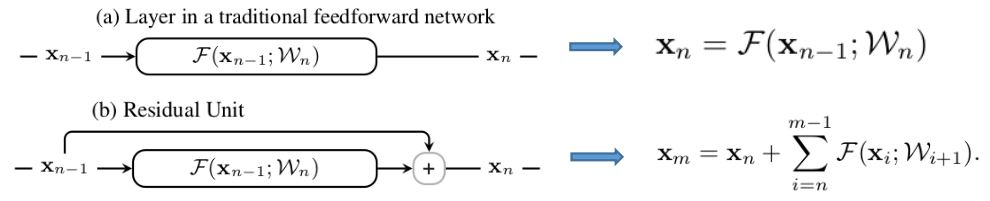
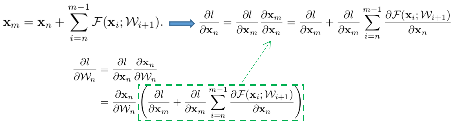
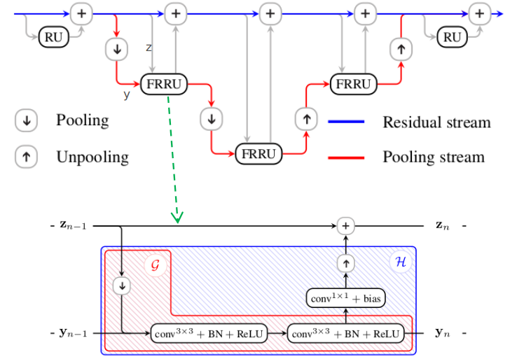
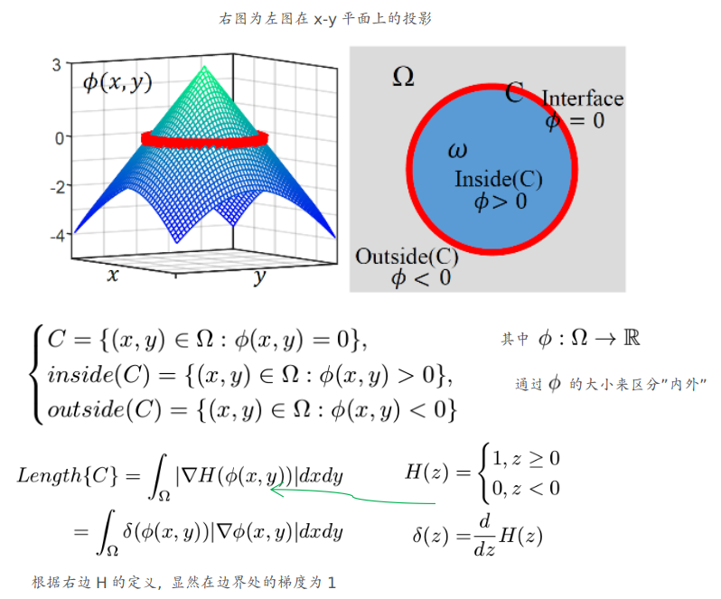
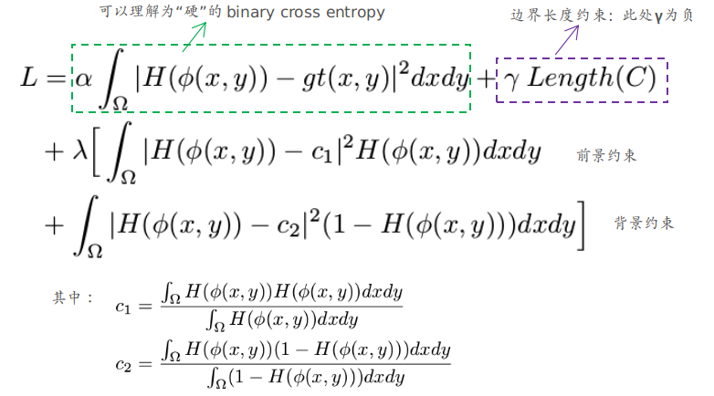
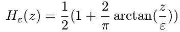
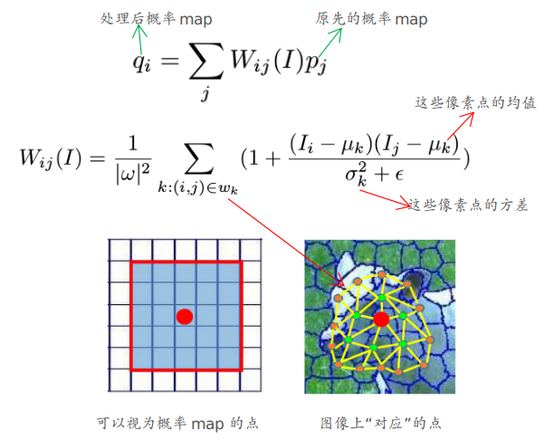
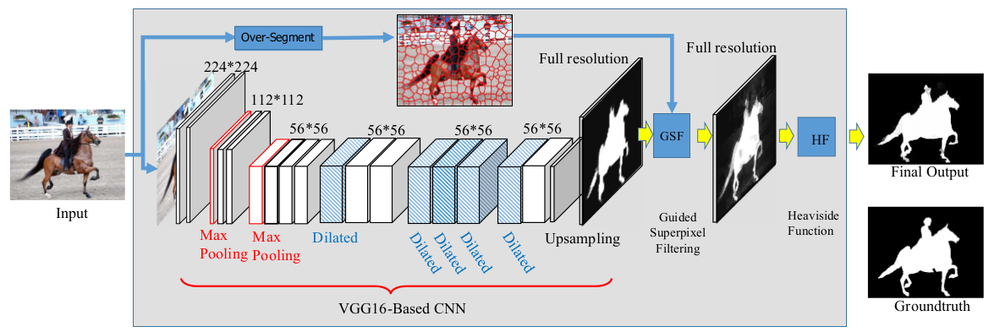

## Full-Resolution Residual Networks for Semantic Segmentation in Street Scenes

主要内容：

1. 介绍当前语义分割方面主要的“方法”
2. ResNet好的一种原因
3. FRRN基本框架

### 主要内容

#### ① 语义分割简介

语义分割方面主要要能够同时解决：1. 辨别性能 (往往“高层特征”比较强)---和分类的网络往往挂钩  2. 定位性能 (一般指的是对边缘等区域分割的性能，往往“低层特征”比较强)。 因此如何处理好两者之间的关系就比较重要了。 （例如：池化层能够增加分类网络的鲁棒性和感受野，但是会削弱定位性能）。 一些常见的方法：

1. 采用skip connection等方法，将低层次信息与高层次信息关联起来。
2. 采用multi-scale的形式来增强“定位性能”（这种方式和1有许多不同形式的延伸）
3. 通过“后处理”的形式来增强边缘的区分能力，如CRF-平滑处理（有许多此方法的变种，将此“后处理”转换成网络的形式，将其参数也通过学习的方式获得---End-to-End的方式）
4. 还有一些其他的操作：如采用domain transfer的方法来增强分割结果的平滑性等等

#### ② Feed-Forward NN & Residual Networks

两者的形式如下所示：

下面来看多个Residual Unit结构“结合起来”的情况，其式子以及对应求导情况可以表示成下述形式（严格形式不是如此，但可以转化为下述形式）：

从上面可见，我们在参数更新时，与$\frac{\partial l}{\partial x_m}$有关(而此项与深度(m-n)无关)，以及后一项与深度相关。这样即使某一部分出现“梯度消失”等糟糕情况，也不会破坏掉前面的参数更新（可以想象成解决了远离末端的前面那些参数的更新“烂掉”的情况---因为离末端近的参数梯度也能够传播给远离末端的那些参数）

#### ③ FRRU结构：此文章的网络结构

上述结构可以看成两个分支：1. 蓝色分支(residual stream)：始终不改变输入的分辨率(即没有任何池化或stride>1的情况)，尽可能保证“定位信息”的准确性   2. 红色分支(pooling stream)：类似Encoder+Decoder的FCN结构，用来保证“辨别性能”。

## Deep Level Sets for Salient Object Detection

主要内容：

1. Level Sets的概念
2. Guided Super-pixel Filtering
3. 整体架构

说明：level sets的概念一般适用于“二元分割”问题，在此处引入的主要原因在于最后得到的概率map各个点往往假设相互独立，这就导致分割结果在边缘等地方处理不好。而引入level sets以及super-pixel filtering的概念均是为了进一步在概率map上面增加进一步的联系。

### 主要内容

#### ① Level Set

说明：

1. 上述的H可以视为硬划分(叫做Heaviside Function)，在真实使用时，作者将其改为了软化分
2. Level Set往往用来进一步构造energy function（即优化目标）

此文章中基于Level Set构造的损失函数如下所示：

此处个人对$c_1,c_2$有些存疑，如果是“硬”感觉没什么意义？

对于上式的说明：

1. 采用的“软划分”H(叫做Approximated Heaviside Function):
    
2. 其中各个参数：$\alpha=0.75,\gamma=-0.005,\lambda=0.2$（$\gamma$取负可能和常见的不同，但此处由最后得到的情况来看，是边界还不够细，因此适当需要使“边界”长度增大一些）

#### ② Guided Super-pixel Filtering

这一步主要为了进一步增强得到的“概率map”（增强概率map上点与点的联系）

说明：

1. 图像先利用fast gSLICr算法划分成400~500个“块”，再利用深度优先搜索(BFS)寻找中心点附近24个“邻近”像素点的像素值。在将此像素值代入$W_{ij}$计算表达式
2. 此步可以理解为结合图像粗划分来进一步增强得到的概率map

#### ③ 整体架构

说明：

1. 训练师先利用Binary-cross-entropy训练15轮之后，再利用上述的level-set对应的能力函数进行fine-tuning（这两步均不加入guided super-pixel filtering层）。之后再加入②中介绍的内容再进行fine-tuning

