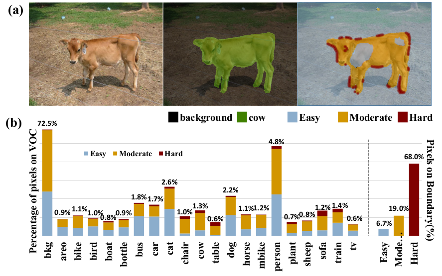

## Not All Pixels Are Equal: Difficulty-Aware Semantic Segmentation via Deep Layer Cascade

主要内容：

1. 将图片上的像素点“区别”对待。（“浅”网络足以对付“简单”的像素点，“深”网络来对付“困难”的像素点）
2. 基于区别对待来设计网络（“中途”抛弃简单的像素点对应的feature）

### 主要内容

#### ① 区别对待的缘由

作者发现在验证集上面各个像素点的“概率”之间有区别（此处可以视为在常规训练好的分割网络得到的概率map）。从而将像素点根据其概率划分为3类：easy set (被正确分类且概率>95%)，hard set (被错误分类，且概率>95%)，moderate set (除了上述两类之外的像素点) ～ 而这三类之间的统计结果如下图所示：
 

具有下述规律：

1. 接近70%的hard set落在边界区域（也可以从(a)中最右边的图看出来），且总的数量占整体比例非常小
2. 每类物体的像素点接近有30%的像素点属于easy set

从而可以“区别”对待像素点，比如前面的网络解决掉easy set，让后续的网络专心处理hard set等

#### ② 网络架构

此处采用的结构就如左下图所示：L1来去除掉一部分像素点（这些像素对应的feature就不接着传到给B阶段），L2又继续去除掉一部分像素点，之后最后由L3处理剩下的像素点。最后将这三部分处理结果结合起来就是最终的结果。

其中几个需要稍微说明的地方：

1. 此处L1, L2处理阶段选择的阈值一般取[0.9, 1.0]（文章中的结果最好的是0.985）
2. 训练分为两阶段：第一阶段不采取“丢弃”策略，三个损失函数合起来训练。在之后采用“丢弃”策略进行进一步训练
3. 还有进一步关于Residual Net如何结合的问题细看论文