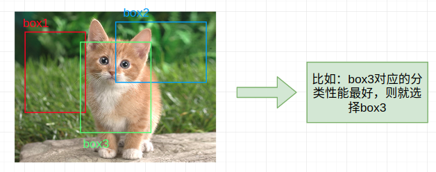
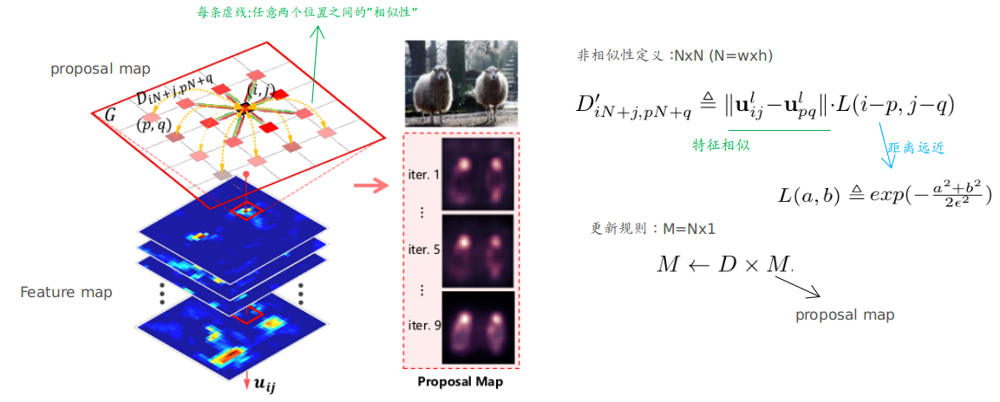
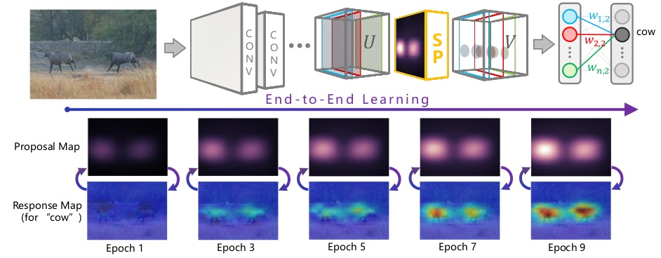
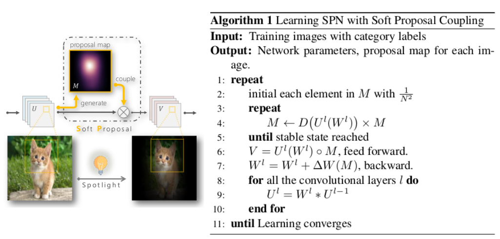

## Soft Proposal Networks for Weakly Supervised Object Localization

主要内容：

1. 弱监督的目标定位：这篇的思想和独特，引入了soft proposal（可以理解为产生一个“指导”的map，而这个“指导”的map蕴含着目标位置的信息，能够帮助feature map进一步将“关注点”落在目标区域）
2. 采用了全连接的图模型来产生这个soft proposal，且根据feature map自我更新（采用随机游走的方式，需指出的是从feature map产生proposal map这段过程不进行反向传播---但是最终的损失只要更新了前面产生的feature map，这个proposal map自然而然也会进行变化）

### 主要内容

#### ① 目标定位中常见的弱监督方法

方式1：pipeline的方式，这种首先产生一堆bounding boxes，然后寻找出哪个bounding boxes使得最终的分类性能最佳（当然也有类似Faster-RCNN中采用的RPN方式来产生这些bounding boxes）。

说明：

1. 真实情况产生的boxes会非常非常多。采用的方法也有很多种
2. 方式1往往是需要两个阶段，一步来产生这些boxes(比较耗时)，另一步来判断那个boxes最佳。

方式2：unified framework，这种方式一般和heat map联系起来 (很多做可视化工作的文章产生heat map)。其主要原理是根据分类过程中网络其实是有学到那些区域对结果起主要的作用，而将这些区域进行一定的处理即可进行目标定位。（这种方法往往容易收到噪声以及背景等的干扰，性能一般）

方式3：这篇文章引入的soft proposal其实可以视为方式2的进一步扩展，对产生的heat map进一步进行了“处理”，而这个处理原理则是根据各像素点之间的“相似性”

#### ② Soft Proposal结构

说明：

1. 关于“非相似矩阵”的解释：距离项可以看出来距离越远值越小，特征项可以看出来越相似值越小（你可以理解为其他点对该点的影响：不同的时候当然影响越大，越近的时候当然影响越大）
2. 关于proposal map的更新规则：可以看出来`M=DxM`（这样每次更新之后`M`都变了，只要继续更新下去就能够达到稳态，即`M=Dx(Dx(DxM))...`。此外`M`每个点均初始化为`M=1/N`）--- 文章中说此处采用10轮迭代就基本能够达到稳态了，但实现中采用的是最多20轮
3. 虽然这个`M=DxM`过程不进行反向传播，但由于`D(W)`与网络参数有关(因为包含feature map)，所有网络更新也会导致soft proposal进行更新

#### ③ 整体结构

下面左图能够说明此soft proposal起的作用，右边则是具体的算法流程

